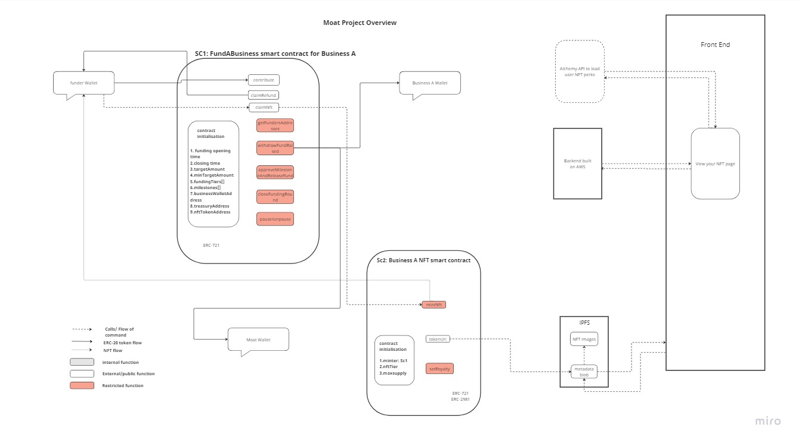
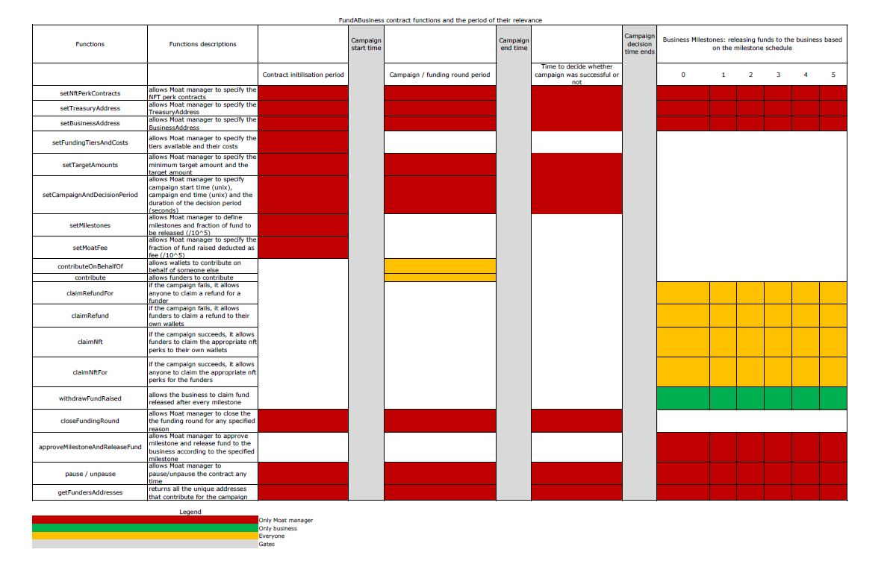
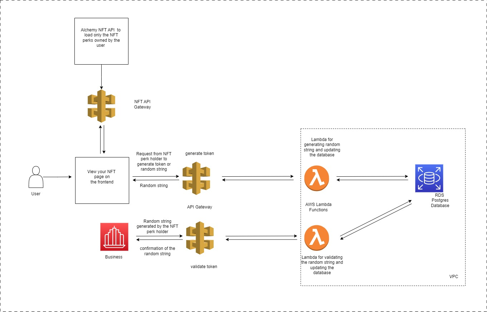

# Project Moat Overview

Project moat is a decentralised crowd-funding platform that allows businesses
to raise funds through crowd-funding. Contributors would be rewarded with nft of
different perks based on how much the contributor contributed during the campaign
period or funding round once the target amount is met.

Contributors would be able to contribute through fiat (banking system) and through
cryptocurrency during the funding round. The nft perks given as the reward to the
contributors will guarantee the contributor a special discount and vip access with
the business. The contributor would also have the option of selling the nft perk on
the secondary market to recover his/her investment anytime. The new buyer have
to continuously patronise the business to claim the discounts and vip access attached
to the nft perks. This way, the business customer-base keeps growing, the business
itself keeps growing and the values of the nft perks also increase in the secondary market.

However, if the target amount is not met during the funding round and the campaign
fails all the contributors or funders will be able to claim their refund or it
may be sent to their wallets.

### Benefits of Project Moat

1. Unlike the traditional crowd-funding space, the businesses do not have to promise
   unrealistic return on investment to the contributors. The contributors are not shareholders
   in the business. This gives sufficient time to the startup (business) to grow and expand
   carefully.

2. The contributors also become customers to the business as they can only use their NFT perks
   to claim discounts and VIP access with the business.

3. Anytime these NFT perks are sold in the secondary markets, the business gets royalties and gains
   a new customer. Royalties from the secondary markets give the business additional cash flow.

4. Contributors are able to see how and when funds-raised are released to the business according
   to the milestones defined in the contract as the approval and release of funds will be done on-chain.
   This guarantees transparency.

5. Since fiat contributions will be accepted, many more new users will be brought to the web3 space.

Project Moat will generate cash flow by taking fractions of the fund raised and the NFT royalties
in the secondary market. Project Moat team plan to develop NFT marketplace as secondary market for
the NFTs and hopes to eventually become a DAO. As a DAO, the project will be community-owned and the team
can continue to effectively screen every business that comes to raise funds on the platform.

## Background and Challenges We ran into

The Project Moat team first conceived the idea of a decentralised crowd-funding platform a few weeksbefore the Chainlink Hackathon started. Then we started writing the smart contracts.The FundAbusiness contract was initially developed to accept only stable coins.

However, a few days into the implementation, the USDC stable coin lost its peg. The first US bankcollapse this year happened. Then a few more banks also went under. Then, we realised that keepingstable coins on the contract for a long period of time is risky.

While we explore other options, Chainlink Hackathon started. We wanted to participate in the hackathon so we thought of ways to upgrade the project we are building. We decided to accept only ETH or native coins of the host blockchain. We used Chainlink DataFeed to fetch the real-time price of ETH and calculate the equivalent amount of every contribution. Then we proceeded to building the frontend and backend (including APIs)of the project.

## Implementation

The Figure 1 below shows the overview implementation of the project. Two smart contracts were written; the
FundABusiness.sol and the NFTperks.sol. The FundABusiness.sol contract manages the crowd-funding campaign.
It has the minter-role of the NFTperks.sol contract and it would be able to mint NFTs to funders or
contributors once the campaign is declared successful and the NFT contracts are set.



```
Figure 1: Overview of the implementation
```

The Figure 2 below describes all the callable functions in the FundABusiness.sol. All the functions have
a period of time when they are callable. For example, the contribute function is only available when the campaign period is open while claimRefund function can only be called when the campaign has failed.
The Project Moat manager would be able to use the contributeOnBehalfOf function to deposit fiat
contributions on behalf of the fiat contributors.



```
Figure 2: FundABusiness functions
```



```
Figure 3: overview of the backend APIs for user to generate random string and for the business
to validate the generated random string.
```

The figure above shows the overview of the architecture of the two APIs.

### Tech-Stacks Used to build this Project

1. Hardhat framework for building smart contracts.
2. Chainlink Datafeed used for the "contribute" function in the FundABusiness contract to get the current
   price of ETH so that the value of the Tier Perks can be accurately calculated in ETH.
3. Next.js, Tailwind.css, Web3uikit and Moralis were used to build the frontend.
4. Smart contract tests, frontend and backend are written in Typescript.
5. Serverless framework was used to manage resources on AWS.
6. AWS Lambda, API Gateway and RDS Postgress were used to create the backend.
7. Alchemy API were used to fetch accounts Moat NFTs on the View Your NFTs page.
8. IPFS, NFTStorage + Filecoin used to host the NFT metadata and images.


### View your NFT Page on the Frontend

On the View your NFT page on the frontend, the contributors will be able to generate a token
or random string with their NFT perks. With this random string, a contributor (user) can go to the
business and claim their perks. The business just needs to call the validate-otp API.

Here is how it works; once the user connects his/her wallet to the View Your NFT page, the Alchemy
NFT API is called to load and display all the NFT perks in the user wallet. With any of the NFT,
the user can generate the random string by clicking the NFT. In the background, the clicking
action calls the generate-token API and it responds with the random string. The NFT data and the
corresponding random string are stored in the AWS RDS database for the eventual validation API
call.

It is expected that the user will go to the business with this random string to claim the NFT perks
benefits. The business will make API call through the validate-otp API and an appropriate response
will be received from the backend. The API call also updates the database with the random string
status to "used".

```
Serverless Framework template was used to build this backend on AWS.
```

This is a [Next.js](https://nextjs.org/) project bootstrapped with [`create-next-app`](https://github.com/vercel/next.js/tree/canary/packages/create-next-app).

## Running this Project Locally

To run this project locally, this [crowd-fund-frontend-backend-hackathon repo](https://github.com/CROWDDIT/crowd-fund-frontend-backend-hackathon) and the [crowd-fund-hardhat-hackathon repo](https://github.com/CROWDDIT/crowd-fund-hardhat-hackathon) must be cloned.

1. To clone these repos, run the following command on your cli;

```bash
git clone https://github.com/CROWDDIT/crowd-fund-frontend-backend-hackathon.git
cd crowd-fund-frontend-backend-hackathon.git
yarn

git clone https://github.com/CROWDDIT/crowd-fund-hardhat-hackathon.git
cd crowd-fund-hardhat-hackathon.git
yarn
```

2. Then go into crowd-fund-hardhat-hackathon/utils/constants.ts, change the CAMPAIGN_PERIOD
   values.

CAMPAIGN_PERIOD = [unix start time, unix end time, time (in seconds) required to make a decision]

Convert a future time to unix time and enter it as the campaign to start. Similarly, convert a
later time in the future to unix time and enter it as campaign end time. You can use the
[unix timestamp convert](https://www.site24x7.com/tools/time-stamp-converter.html) to do the
conversion.

3. Ensure the frontEndContractsFile parameter in the crowd-fund-hardhat/utils/constants file is rooted to crowd-fund-frontend-backend-hackathon/constants/fundABizAddress.json and crowd-fund-frontend-backend-hackathon/constants/nftPerksAddresses.json location in the crowd-fund-frontend-backend-hackathon repo. Also, ensure frontEndAbiLocation parameter in the crowd-fund-hardhat/utils/constants file is rooted to crowd-fund-frontend-backend-hackathon/constants/ folder in the crowd-fund-frontend-backend-hackathon repo.

4. Finally, set the SET_NFT_PERKS and UPDATE_FRONT_END parameters in the .env file of crowd-fund-hardhat repo to true as shown in the .env.example file.

5. Then start the hardhat local blockchain by running this command in crowd-fund-hardhat-hackathon
   directory;

```bash
yarn hardhat node
```

6. While the blockchain is running in the background, using another terminal, change directory to
   crowd-fund-frontend-backend-hackathon folder. Then, run the development server:

```bash
yarn dev

```

Also, get the API key from Alchemy to view your Moat nft on the testnet or mainnet. Enter this
API key into the crowd-fund-frontend-backend-hackathon/.env file to set NEXT_PUBLIC_ALCHEMY_MUMBAI_API_KEY
parameter as shown in the .env.example.

7. Open [http://localhost:3000](http://localhost:3000) with your browser to see the result.

You can interact with the frontend by connecting your wallet.

#### Note:

1. You can only contribute to the campaign when the campaign is open after the start-time entered above has passed.
2. View Your NFT page uses the Alchemy API to query and display all the users NFT perks and the
   API is only available on the testnet and mainnet. Therefore, the paige will only show "No NFT found"
   when on a local chain.
