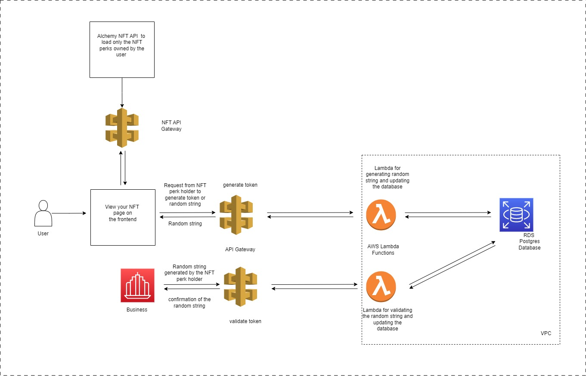

## Project Moat APIs



The figure above shows the overview of the architecture of the two APIs.

### View your NFT Page on the Frontend

On the View your NFT page on the frontend, the contributors will be able to generate a token
or random string with their NFT perks. With this random string, a contributor (user) can go to the
business and claim their perks. The business just need to call the validate-otp API.

Here is how it works; once the user connect his/her wallet to the view your NFT page, the Alchemy
NFT API is called to load and display all the NFT perks in the user wallet. With any of the NFT,
the user can generate the random string by clicking the NFT. In the background, the clicking
action calls the generate-token API and it respond with the random string. The NFT data and the
corrensponding random string are stored in the AWS RDS database for the eventual validation API
call.

It is expected that the user will go to the business with this random string to claim the NFT perks
benefits. The business will make API call through the validate-otp API and an appropriate reponse
will be received from the backend. The API call also update the database with the random string
status to "used".

```
Serverless Framework template was used to build this backend on AWS.
```
